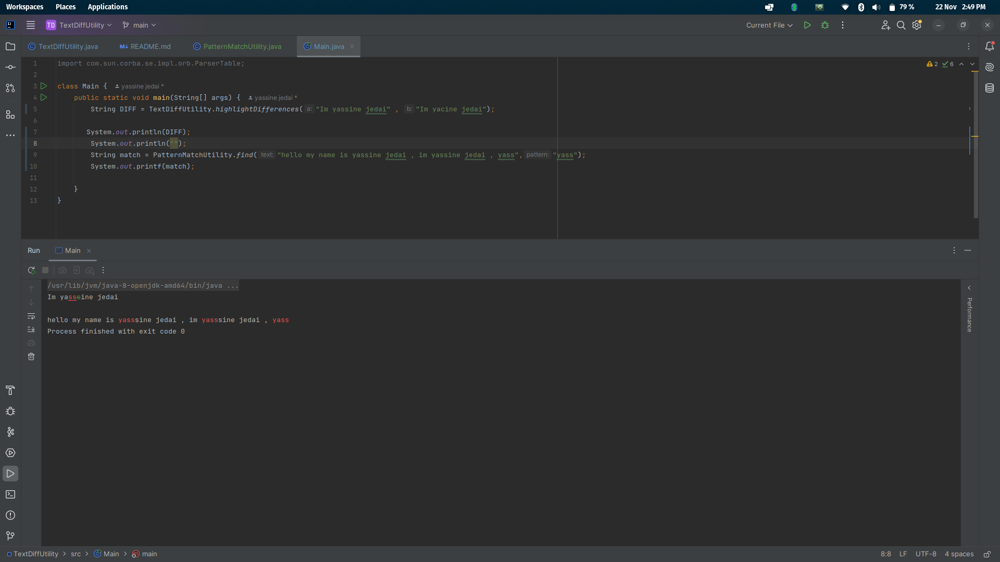

# **String Processing Utility**

This project provides a collection of string processing utilities, including:
- **Knuth-Morris-Pratt (KMP) Algorithm** for efficient string matching.
- **Longest Common Subsequence (LCS)** for finding the longest subsequence common to two strings.

Both utilities are designed to help with pattern matching, string comparison, and text highlighting, making them useful in various text processing tasks.

## **Features**
- **KMP Algorithm**: Efficient pattern matching with **O(n + m)** time complexity, where `n` is the length of the text and `m` is the length of the pattern.
- **LCS**: Computes the longest subsequence common to two strings, useful for text comparison and diff operations.
- Highlights matched substrings in **red** using ANSI escape codes for the KMP-based matching.

## **Time Complexity**

### **KMP Algorithm**
The **KMP algorithm** has a **time complexity of O(n + m)**, where:
- `n` is the length of the text in which we are searching for the pattern.
- `m` is the length of the pattern.

This efficiency is achieved because the KMP algorithm preprocesses the pattern in **O(m)** time to create the prefix array (`pi[]`), and then searches the text in **O(n)** time, avoiding redundant comparisons.

### **Longest Common Subsequence (LCS)**
The **LCS algorithm** is implemented using dynamic programming with a **time complexity of O(n * m)**, where:
- `n` is the length of the first string.
- `m` is the length of the second string.

This time complexity arises from the fact that we use a 2D table (`dp[][]`) to store the solutions of subproblems, with the table having dimensions `(n+1) x (m+1)`. The algorithm iterates over all the entries in the table, filling each one based on the comparison of characters from both strings. Thus, the time complexity is **O(n * m)**.


## **Usage**

### **1. KMP Pattern Matching**

The `PatternMatchUtility` class implements the KMP algorithm to find and highlight occurrences of a pattern in a text.

#### **Methods:**

- **`buildKmp(String str)`**:  
  Constructs the prefix table (`pi` array) for the given pattern. This table helps skip unnecessary comparisons during the pattern matching.

- **`find(String text, String pattern)`**:  
  Searches for the `pattern` in the `text` and highlights the matched substrings in **red** using ANSI escape codes.

#### **Example Usage and Expected Output:**




---

## **Installation**

1. **Clone the repository:**
   ```bash
   git clone https://github.com/yassjd199/String-Processing-Utility.git
   cd String-Processing-Utility
   ```

2. **Compile and Run:**
   - You can compile and run the Java classes using any IDE like IntelliJ IDEA, Eclipse, or from the command line:
   ```bash
   javac *.java
   java Main
   ```

---

## **ANSI Escape Codes**

- **Red**: `\u001B[31m` (used to highlight matched substrings in the text)
- **Green**: `\u001B[32m` (used to highlight unmatched characters in the second string for LCS)
- **Reset**: `\u001B[0m` (used to reset the text color)

These codes will work on most terminals that support ANSI color codes.

